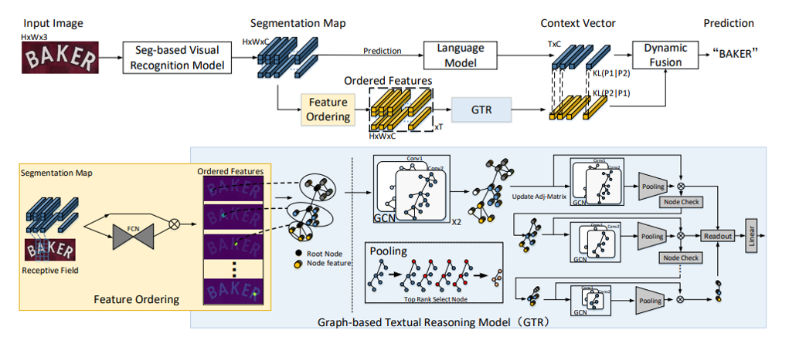

# Overview

## Introduction
This is the official implementation of the AAAI 22 accepted paper : Visual Semantics Allow for Textual Reasoning Better in Scene Text Recognition. [paper](https://arxiv.org/abs/2112.12916) 


## Abstract
Existing Scene Text Recognition (STR) methods typically use a language model to optimize the joint probability of the 1D character sequence predicted by a visual recognition (VR) model, which ignore the 2D spatial context of visual semantics within and between character instances, making them not generalize well to arbitrary shape scene text. To address this issue, we make the first attempt to perform textual reasoning based on visual semantics in this paper. Technically, given the character segmentation maps predicted by a VR model, we construct a subgraph for each instance, where nodes represent the pixels in it and edges are added between nodes based on their spatial similarity. Then, these subgraphs are sequentially connected by their root nodes and merged into a complete graph. Based on this graph, we devise a graph convolutional network for textual reasoning (GTR) by supervising it with a cross-entropy loss. GTR can be easily plugged in representative STR models to improve their performance owing to better textual reasoning. Specifically, we construct our model, namely S-GTR, by paralleling GTR to the language model in a segmentation-based STR baseline,
which can effectively exploit the visual-linguistic complementarity via mutual learning. S-GTR sets new state-of-the-art on six challenging STR benchmarks and generalizes well to multi-linguistic datasets. 


## Framework

[comment]: <> "![]&#40;D:\heyue43\work\accept-paper\1S-GTR\lib\img\motivation.png&#41;"




## How to use
### Env
```
PyTorch == 1.1.0 
torchvision == 0.3.0
fasttext == 0.9.1
```
Details can be found in requirements.txt

### Train
##### Prepare your data
-  Download the training set from 
   Synthesis training dataset: [Baidu](https://pan.baidu.com/s/1uSW0exS_Uaoeo5OJaVkEmQ )(key:c83d) and Real training dataset[Baidu](https://pan.baidu.com/s/1ea76PgR_Dt984Z4DnkaRfA)(key:datm)
- Download the pretrained Seg-baseline visual recognition model from here(soon update)
- Update the path in the lib/tools/create_all_synth_lmdb.py
- Run the lib/tools/create_all_synth_lmdb.py
- Note: it may result in large storage space, you can modify the datasets/dataset.py to generate the word embedding in an online way

##### Run
- Update the path in train.sh, then
```
sh train.sh
```

### Test
- Update the path in the test.sh, then
```
sh test.sh
```

## Experiments
### Evaluation results on benchmarks
* You can downlod the benchmark datasets from [OneDrive](https://drive.google.com/file/d/1ws4SmBBvT6cxs41TfSUpe4uhR_U_AzMk/view?usp=sharing).

|Methods |TrainData|     Checkpoint  | IIIT5K | SVT  | IC13 | SVTP  | IC15 |  CUTE  |
|:--------:|:--------:|:-----------------:|:------:|:----------:|:--------:|:------:|:----------:|:---:|
|SegBaseline| ST+MJ | OneDrive(soon update)  |94.2 |90.8 |93.6 |84.3 |82.0 |87.6|
|S-GTR| ST+MJ | OneDrive(soon update)  |95.8 | 94.1 | 96.8 | 87.9|84.6| 92.3 |
|S-GTR| ST+MJ+R |OneDrive](soon update)   |97.5 |95.8 |97.8 |90.6 |87.3 |94.7|

### Evaluate S-GTR with different settings  
- Investigate  the  impact  of  different  modules in  S-GTR.

|VRM|LM|GTR| IIIT5K | SVT  | IC13 | SVTP  | IC15 |  CUTE  |
|:------:|:------:|:------: |:------:|:-----:|:----------:|:----:|:-----:|:------:|
|√ | | |91.8 |86.6 |91.1 |79.8 |77.7 |84.8|
|√ |√ | |94.2 |90.8 |93.6 |84.3 |82.0 |87.6|
|√ | |√ |94.0 |91.2 |94.8 |85.0 |82.8 |88.4 |
|√ |√ |√ | 95.1 |93.2 |95.9 |86.2 |84.1 |91.3|

### Plugging GTR in different STR baselines 
- Plug GTR module into four representative types of STR methods.

|Methods| IIIT5K | SVT  | IC13 | SVTP  | IC15 |  CUTE  |
|:------:|:------:|:-----:|:---------:|:----------:|:----:|:-----:|
|GTR+CRNN|  87.6 | 82.1 | 90.1 | 68.1 | 68.2 | 78.1   |
|GTR+TRBA|93.2 | 90.1 | 94.0 | 80.7 | 76.0 | 82.1|
|GTR+SRN| 96.0 | 93.1 | 96.1 | 87.9 | 83.9 | 90.7 |
|GTR+PRENBaseline| 96.1 | 94.1 | 96.6 | 88.0 | 85.3 | 92.6|
|GTR+ABINet-LV| 96.8 | 94.8  | 97.7  | 89.6   | 86.9  | 93.1   |


## Issue
1. The train and test datasets are uploaded. The pretrain model will be uploaded  and the training code for MT adative framework will be updated soon.

2. This code is only for S-GTR, and other pluggin models will be updated soon. 

3. To facilitate interested workers to use our model to adapt to other language training, we will provide text guidance in README for other language recognition as soon as possible.

4.We will update the details of the visual recognition model and provide guidance code to generate relevant feature maps for the question in issue.

## Citation
Please consider citing this paper if you find it useful in your research. 
```
@article{he2021visual,
  title={Visual Semantics Allow for Textual Reasoning Better in Scene Text Recognition},
  author={He, Yue and Chen, Chen and Zhang, Jing and Liu, Juhua and He, Fengxiang and Wang, Chaoyue and Du, Bo},
  booktitle={Proceedings of the AAAI Conference on Artificial Intelligence},
  volume={36},
  year={2022}
}

```

## Copyright
For research purpose usage only.